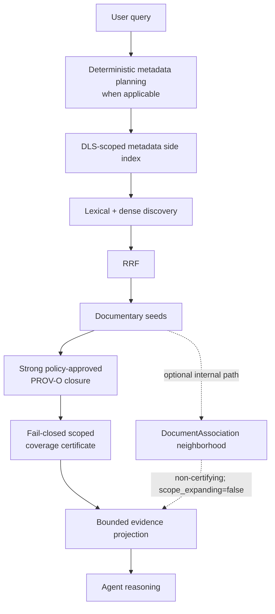

# OpenRAG — Pommerieux fork

### Verifiable documentary investigation over bounded, attributable evidence

This repository is the **FermedePommerieux fork of
[upstream OpenRAG](https://github.com/langflow-ai/openrag)**. It retains the
OpenRAG platform—FastAPI, Langflow, OpenSearch, Docling, the web interface and
SDKs—while adding a documentary-investigation contract.

Compared with the upstream baseline used by this fork, it adds backend-owned
lexical+dense RRF discovery, structured metadata discovery, explicit PROV-O
documentary closure, fail-closed scoped coverage certification, and bounded
evidence projection for LLM reasoning. The upstream relationship and both
comparison references are recorded in [Differences from upstream](docs/docs/upstream/differences.mdx).

Its truth contract is deliberately narrow: metadata is an observation, not
automatically a fact; association is not provenance; retrieval may be
approximate; and `coverage.complete=true` certifies only the accessible graph
closure reached from the discovered seeds under a versioned traversal policy.
It never certifies completeness of the physical archive. See
[Truth and provenance](docs/docs/architecture/truth-and-provenance.mdx).

> **Fork identity:** this is not the upstream OpenRAG project. Upstream is
> credited below and remains the source of the platform on which this work is
> based.

## Why this fork exists

Ordinary RAG can rank useful passages, but a ranked top-k alone cannot prove
that every source unit in a documentary scope was inspected. This fork
separates probabilistic discovery from deterministic investigation:

- OpenSearch lexical and approximate-nearest-neighbour lanes discover
  candidates, fused by deterministic RRF for a fixed pair of input lanes.
- Explicit, policy-approved PROV-O relations define the certifiable graph
  traversal; metadata similarity does not.
- Every discovered document required by the contract is read and verified
  before scoped coverage can be certified.
- The LLM reasons over a bounded projection of source evidence. It does not
  decide truth, provenance, access control or coverage.

## How this fork differs from upstream

The comparison below is about explicit repository contracts, not a claim that
upstream OpenRAG is deficient. “Fork point” means the exact Git common ancestor
with the fetched official upstream repository; “current upstream” means the
separately inspected upstream revision documented on the comparison page.

| Capability | Upstream comparison references | Pommerieux fork |
| --- | --- | --- |
| Retrieval v2 discovery | No upstream product-mode claim is made here; the comparison is limited to the absence of this fork's Retrieval v2 contract | Separate lexical and dense lanes, deterministic RRF, stable chunk tie-breaking and lane diagnostics |
| Documentary investigation | No `openrag.scope-coverage` contract in either compared upstream revision | Strong typed PROV-O closure followed by verified document reads and fail-closed scoped coverage |
| Structured metadata search | No `openrag.metadata-filter` or `openrag.metadata-agent-search` contract in either compared upstream revision | DLS-first side-index restriction, three-valued logic and a bounded Agent tool |
| Metadata provenance | No `openrag.document-metadata` contract in either compared upstream revision | Source-qualified observations, conflicts preserved, no preferred truth in v1 |
| Documentary association | No fork association contract in either compared upstream revision | Internal, bounded, non-certifying `DocumentAssociation`; product activation remains disabled |
| Runtime consistency | Upstream already has workspace configuration | Fork adds configured/effective `RuntimeBehavior` verification for model, prompt and retrieval ownership |
| OpenArchiver attachment identity | No fork attachment contract in either compared upstream revision | Internal OpenRAG-side contract for stable attachment identity and verified binary facts; end-to-end connector ingestion is planned |

Each row, its classification and source evidence are in
[Differences from upstream](docs/docs/upstream/differences.mdx).

## Architecture at a glance

OpenSearch discovery is approximate where ANN is involved. PROV-O closure is
deterministic over explicit, accessible relations for a fixed index view and
policy. `DocumentAssociation` describes bounded documentary proximity but is
not a provenance edge and does not enlarge certifiable scope. Coverage reports
what the policy traversal and verified document reads actually completed.

The current baseline defaults are **q1**, lexical candidates **50**, dense
candidates **50**, RRF `k=60`, scope seed budget **100**, and multi-query
discovery **disabled**. These are current defaults, not permanent promises.

## Documentary truth and provenance

The fork keeps these states distinct:
`ASSERTED`, `OBSERVED`, `ASSOCIATED`, `INFERRED`, `UNKNOWN`, `CONFLICTING` and
`INVALID`.

In particular:

- metadata observation is not factual truth;
- document association is not provenance derivation;
- same author, date or type does not establish document identity;
- candidate lineage is not `prov:wasDerivedFrom`;
- an association neighborhood is not a certifiable closure;
- complete scoped coverage is not completeness of the physical archive.

The normative definitions are in
[Truth and provenance](docs/docs/architecture/truth-and-provenance.mdx), with
the retrieval and certificate rules in
[Retrieval and coverage](docs/docs/architecture/retrieval-and-coverage.mdx).

## Key capabilities and status

| Capability | Status |
| --- | --- |
| Fork-specific lexical+dense RRF discovery | Available now |
| Strong PROV-O scope closure and `openrag.scope-coverage v1` | Available now |
| Structured metadata API and Agent search | Available now |
| Deterministic natural-language metadata planning | Available now; intentionally bounded grammar |
| DLS-aware metadata restriction, retrieval and graph traversal | Available now |
| Archive-backed metadata profiles and side-index projection | Available now |
| `DocumentAssociation` semantics | Internal; bounded and non-certifying; product route disabled |
| Candidate lineage evidence | Internal only; not trusted as provenance and not activated |
| OpenArchiver attachment connector flow | Planned; OpenRAG contract exists, OpenArchiver is unmodified |

Example: “Find the PDFs produced in March 2024 containing budget” is
deterministically decomposed into free text `budget` plus `format = PDF` and source-local
`production_month = 2024-03`. Only a valid deterministic plan uses metadata
search; unsupported or ambiguous constraints fail explicitly instead of
silently broadening retrieval. Domain-specific topic names are not product
heuristics.

## Documentation

- [Architecture overview](docs/docs/architecture/overview.mdx)
- [Differences from upstream](docs/docs/upstream/differences.mdx)
- [Truth and provenance contract](docs/docs/architecture/truth-and-provenance.mdx)
- [PROV-O documentary closure](docs/docs/architecture/prov-o.mdx)
- [Retrieval and coverage](docs/docs/architecture/retrieval-and-coverage.mdx)
- [Document metadata](docs/docs/architecture/document-metadata.mdx)
- [Document associations](docs/docs/architecture/document-associations.mdx)
- [Structured metadata search](docs/docs/product/structured-metadata-search.mdx)
- [Security and DLS](docs/docs/security/dls.mdx)
- [Versioned contracts](docs/docs/reference/versioned-contracts.mdx)
- [Validation methodology](docs/docs/audits/index.mdx)

## Quick start

Installation remains based on upstream OpenRAG packaging and services. Start
with the repository's [quickstart](docs/docs/get-started/quickstart.mdx), then
read the fork's [architecture overview](docs/docs/architecture/overview.mdx)
before treating retrieval output as documentary evidence.

## Known limitations

- Dense ANN candidate membership may vary across index/segment state, plugin
  changes or externally generated query vectors.
- Scoped coverage is relative to discovered seeds, DLS-visible indexed
  entities and the declared traversal policy.
- Embedded, archive, filesystem and ingestion metadata can be missing, false,
  invalid or conflicting; some timestamps have an unknown timezone.
- The natural-language metadata grammar is deliberately limited.
- Association neighborhoods are not enabled as a product retrieval path.
- Candidate lineage does not create a trusted provenance relation.
- Historical archive coverage has known unavailable or unparseable items.

## Upstream, license and attribution

This repository is a derivative fork of
[langflow-ai/openrag](https://github.com/langflow-ai/openrag). The exact Git
relationship and comparison scope are documented in
[Differences from upstream](docs/docs/upstream/differences.mdx). Upstream names,
logos and project links are retained for attribution and do not imply that this
fork is the upstream project.

The repository remains licensed under the [Apache License 2.0](LICENSE).
