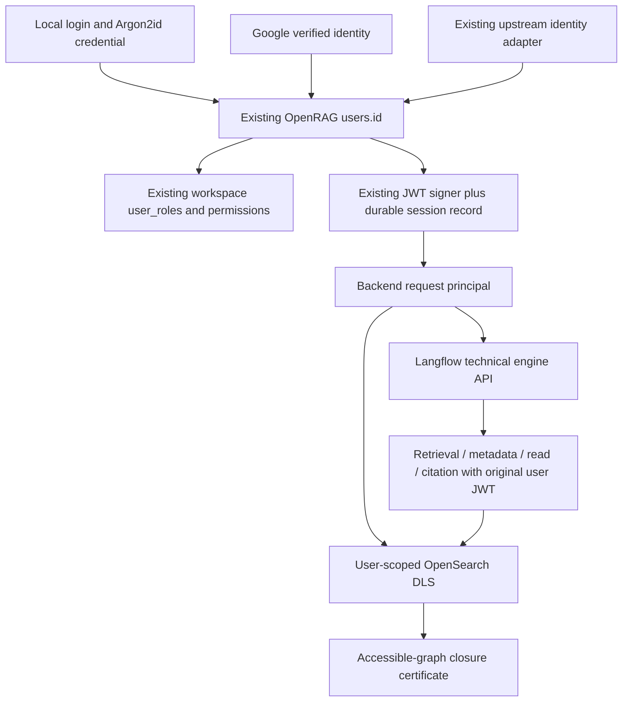

# ADR 0010 — Local credentials on the existing OpenRAG principal

Status: inventory completed before implementation, 2026-09-05. Activation is gated
by the separate validation report; this ADR does not claim production activation.

## Baseline and ancestry

After `git fetch --all --prune`, canonical
`origin/pommerieux/v0.6.0-retrieval-v2-prov-o` is
`6e8b8a095928739a9acade2ca017a6a405edb19e`. None of `69f215d0`, `14dd04cd`,
or `c985086e` is its ancestor. The smallest deployed correctness base is
`69f215d0bc56c0a9cd83d0f8ee5505780d91a9f9` (canonical plus `5147fc3e` and
`69f215d0` P0 coverage repairs). Production backend image is retrieval-v2.109,
frontend .105, Langflow .71; GitOps origin/main is `7d481d718825c3a707afbde613e7bed4e8f381bc`.
The live preflight returned no-auth, SQLite application DB, OpenSearch green,
RuntimeBehavior MATCH, locked managed flow v18, backend/frontend 1/1 and Langflow 2/2.
The original checkout has unrelated edits and is untouched. New worktree:
`openrag-compose-multiuser-local-auth`, branch `agent/multiuser-local-auth`.
Occurrence/generation candidates and migration tooling are excluded.

## Existing inventory

| Concern | Existing authority and path |
|---|---|
| Application user | `db/models/user.py`: `users.id`, immutable PK; unique `(oauth_provider, oauth_subject)`; encrypted PII; `is_active` exists but is not checked by old browser sessions |
| Persistence | `db/engine.py`: `DATABASE_URL`, defaults to durable `data/openrag.db`; production uses this SQLite DB, not Langflow PostgreSQL |
| Roles | `roles`, `user_roles`, `permissions`, `role_permissions`; `services/rbac_service.py`; RBAC opt-in, no first-user admin bootstrap |
| Workspace | one deployment workspace; `workspace_config` stores configuration, no user tenant/membership table; roles associate users with this workspace |
| User creation | `services/user_service.ensure_user_row`: provider/subject upsert, same subject usually preserved as PK, UUID on collisions; legacy-only email merge; unrelated providers with same email stay distinct |
| Request principal | `session_manager.User` currently distinguishes provider `user_id` from `db_user_id`; `auth/request_identity.py` attaches DB ID, then downstream ownership often uses `user_id` |
| Browser sessions | `SessionManager` signs seven-day JWTs with existing RSA/JWKS machinery; `auth_token` HttpOnly/Lax cookie; in-memory user registry; logout previously only clears cookie |
| Local passwords | absent in OpenRAG; no hash, login, reset, create-user API; permission catalog already contains users:list/read/invite and roles:assign |
| Langflow | installed 0.11.2 has native UUID/username/password/is_active/is_superuser accounts and authentication service; these own flow-engine access, separate from OpenRAG users and DLS; backend uses technical API key and forwards end-user identity independently |
| Google | `AuthService`, Google Drive OAuth verification, app_auth callback and session issuance; currently the only browser app OAuth login |
| Microsoft | MSAL, OneDrive/SharePoint OAuth adapters and connector principals; data-source OAuth, no existing Microsoft app-login button/route |
| OIDC/upstream | IBM AMS cookie/header/gateway JWT and configurable issuer verification; OpenRAG itself serves OIDC discovery/JWKS for OpenSearch; there is no generic browser OIDC provider list |
| Frontend | `contexts/auth-context.tsx`, `/login`: Google or upstream IBM; `/api` Next proxy strips prefix; `/users/me` reports provider ID and DB roles |
| Anonymous | missing Google credentials and IBM disabled implicitly enables `AnonymousUser`; default anonymous RBAC role admin; this is development compatibility, unsuitable as auth initialization fallback |
| Ownership | documents/metadata/knowledge_filters use owner, allowed_users, allowed_principals; chat ownership uses application DB; connectors retain existing provider alias mappings |
| DLS | securityconfig/roles.yml: JWT sub → `${user.name}`; owner/allowed_users, legacy verified email aliases, connector lookup row; ownerless records deliberately shared; no OpenSearch admin role for normal users |
| Product propagation | browser cookie/Bearer → request identity → user-scoped OpenSearch; chat forwards original JWT through Langflow → backend retrieval/metadata/read/citation; `auth_context` uses contextvars |
| Counts | ASTRA-020: KnowledgeFilterService reads existence aggregation with admin client, exposing a global active_source_count for a shared filter |

## Ownership diagram and decision

OpenRAG support is PARTIAL: reuse its user DB, role catalog, signer, cookie and
request dependencies. Add a local credential as a method referencing `users.id`,
and revocable SQL session records. Do not federate Langflow technical accounts
or introduce another credential database. Local login identifiers are separate
from user IDs and emails; local IDs are random UUIDs. No general public registration or
email-based linking; no local password is automatically attached to an external
account. Existing external IDs and historical ownership remain unchanged.

Deployment mode is explicit (`auto` for legacy compatibility, `local`,
`local_plus_external`, `external`, `no_auth`). Explicit authenticated modes fail
closed; local modes require RBAC and exclude the incompatible IBM gateway mode.
Optional Google login in mixed mode and Microsoft connector capabilities remain.
The first local administrator can be created by an explicit operator CLI using
a password prompt, or by opting into local login in the first browser onboarding
of a fresh installation. In automatic mode this commits mandatory local login
and RBAC in the existing SQL store before publishing the runtime policy. The
choice survives restart; explicit deployment modes retain priority. Skipping
or upgrading an already configured installation permanently closes browser
enrollment, including across provider-onboarding resets. Thereafter authenticated
admin APIs and Settings → Local users manage accounts using the existing roles.

## GenerationHead handoff (design only)

Choose BACKEND_ONLY_CONTROL_INDEX. User-readable `documents*` currently makes
ownerless records shared; GenerationHead is control state, not documentary
evidence. Store it in a distinct `openrag_generation_control_v1` index outside
all user index patterns. Only the backend index-admin client may query/CAS it.
Reads first resolve an occurrence through the user-scoped document client, then
the backend may resolve that occurrence's current generation, then reads all
evidence again through the same reader-scoped client. Never return control rows,
hidden occurrence IDs, or global generation counts. Metadata and provenance
retain the occurrence ACL and reader-relative coverage contract.

Before resuming identity v1, test two same-owner occurrences with independent
heads and a second principal: deny GET/search/mget/alias access to the control
index for both ordinary users; prove lifecycle race/CAS behavior, separate
owner boundaries and no hidden control identifiers in responses. The architectural
choice addresses the ownerless control-record flaw, but implementation/live
canary and all original migration gates are still required. No migration is run here.

## Controlled validation outcome — 2026-09-05

Local credentials, durable principals, account lifecycle, provider-independent
startup and browser login through Next are validated. The real OpenSearch/
Langflow canary uses two API-created local readers and temporary application
storage. Both readers pass lexical/dense/hybrid isolation, metadata predicates/
pagination/counts, shared-filter reader counts (ASTRA-020), direct reads,
citations, ordinary leaf coverage and retrieval streaming. Each user-scoped
client receives 403 querying the separate backend-only control index.

The activation-gate follow-up closes the two observed product failures:

1. Cross-owner typed provenance now distinguishes backend-proven DLS exclusion
   from genuinely unresolved references under [ADR 0011](0011-reader-visible-provenance-closure.md).
   Both real readers obtain complete certificates without exposing the other
   reader's identifiers, edges or counts. Missing and malformed provenance still
   fails the P0 regressions.
2. The metadata implementation and wiring already existed, but Langflow native
   Tool Mode did not expose both outputs of the same upstream component. One
   `component_as_tool` output now returns both StructuredTools via `_get_tools()`.
   The live managed flow was repaired and re-locked; both readers exercise real
   metadata callbacks, citations and streaming successfully. Agent prompt/model
   and provider values are exactly preserved.

The final gate passes all 28 live two-user checks and 2,075 unit tests. Two real
archived/ingestion originals were also copied into isolated scratch storage;
actual A/B DLS downloads, source-ID preservation and rollback pass. No source
file or production ACL was modified.

Final Agent validation checks the actual answer text, its exact own-source
citation and the last canonical coverage certificate, independently of tool
artifacts. The initial 26-check result was superseded: artifact markers could
mask an unhelpful answer or incomplete multi-query coverage. Two subsequent
failed runs exposed agentd/LiteLLM provider lookup and a rejected model prefix.
The OpenAI query-only planner now reuses the configured client through the native
Responses SDK method, sending the unchanged model name without MCP injection.
Other providers retain their adapter. Both explicit multi-query checks and all
six Agent responses pass with complete, verified coverage in the final run.
Earlier failed runs remain in the private audit evidence.

Settings → Langflow → Agent now exposes the search planning model separately
from the chat model. The default follows the chat model; clearing both explicit
planner fields persists that choice in SQL and survives subsequent chat changes.
Six API tests cover persistence/reset/permissions and ambiguous updates; four
browser tests cover selection, reload, unavailable models, permissions and save
errors. TypeScript checking and the frontend build pass. This UI and the native
planner repair are in the candidate; they have not been deployed to production.

Production remains on its original images and anonymous mode. GitOps pins only
the flow repair at 896f1361e1324d07cf888634501fff4ae8a81591, based directly on
the deployed P0 commit. The current backend recognizes repaired marker 18 on
restart; the auth candidate recognizes both exact v18 graphs and migrates them
to v19. RuntimeBehavior remains MATCH. General activation, administrator
creation, connector-key rotation and data migration have not been executed.
Identity v1 remains blocked. External-provider coexistence is code/configuration
validated; no live Google, Microsoft or OIDC login was performed.
