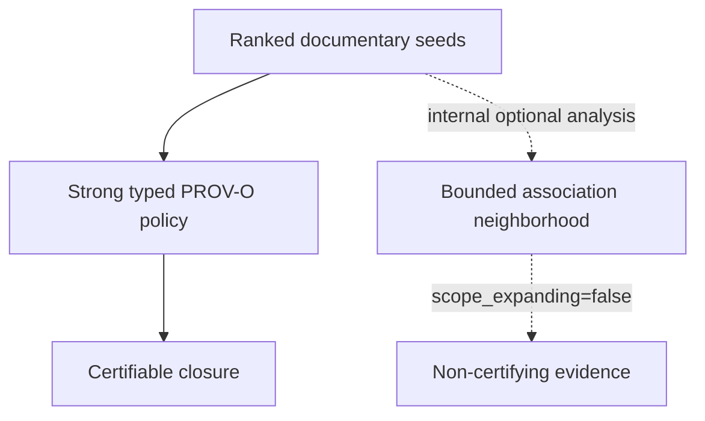

# Document associations

`openrag.document-investigation-association v1` is an implemented internal
semantic model for auditable documentary proximity. It is not a provenance
model, does not assert identity or derivation, and is not currently exposed as
a product retrieval route.

```text
Status: INTERNAL / PRODUCT ROUTE DISABLED
scope_expanding: false
completeness: BOUNDED_NOT_EXHAUSTIVE
```

## Association evidence

The model can compare source-qualified evidence along dimensions including:

- production and modification instant, day, month or year, with local and UTC
  calendar bases kept distinct;
- source system and explicit source-entity family;
- explicit parent collection;
- document type, MIME and extension;
- creator, last-modifier, producer and creator-application observations;
- filename basename;
- complete binary SHA-256.

Each result records the precise dimensions and evidence that contributed to
its strength. `ASSOCIATED` is descriptive: it is not `ASSERTED`, and it never
creates `prov:wasDerivedFrom`.

## Mega-hub safety

Broad metadata dimensions can connect huge parts of a corpus. “Same source
system”, “same year” and “same MIME type” are particularly weak standalone
signals. A broad parent collection can have the same effect if explicit
attachment parents and general containment are conflated.

The activation wrapper therefore imposes hard document, association and
per-dimension bounds. Broad standalone dimensions—including source system,
year, MIME, extension, filename and the current combined parent key—are
blocked from the conservative default. Any future activation requires an
explicit reviewed policy and new human evaluation.

## Separation from closure



Only strong, explicit and policy-approved PROV-O relations participate in
`openrag.scope-coverage v1`. An association neighborhood cannot make a graph
complete, cannot turn an inaccessible object into a visible one, and cannot
affect `coverage.complete`.

Candidate lineage is likewise evidence for review only. The current builder
emits candidate evidence without a lineage edge. Trusted lineage inference is
**not implemented**.

## DLS

Candidate inputs are pre-bounded to accessible document identities before
bucketing. Hidden documents therefore do not create buckets, strengths,
counts, truncation or output associations. This does not activate the feature;
it is an invariant of the internal implementation.

## Evidence

See the
[`DocumentAssociation` models](https://github.com/FermedePommerieux/openrag-compose/blob/975f933fa3149dd60a0f481d5a51ae184d6ddf0d/src/models/document_investigation.py),
the
[bounded activation wrapper](https://github.com/FermedePommerieux/openrag-compose/blob/975f933fa3149dd60a0f481d5a51ae184d6ddf0d/src/services/document_association_activation.py),
and the
[post-backfill association audit](https://github.com/FermedePommerieux/openrag-compose/blob/975f933fa3149dd60a0f481d5a51ae184d6ddf0d/benchmarks/document-metadata/post-backfill-association-audit-report.md).
