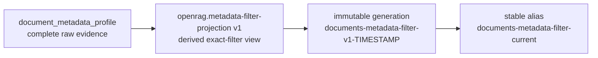

# Document metadata provenance

Document metadata extends an existing documentary entity; it does not create a
second identity or a provenance edge. The raw profile contract is
`openrag.document-metadata v1`, normalized under its own versioned policy and
retained with `openrag.metadata-resolution v1` semantics.

## Observations, not preferred truth

The profile separates identity, embedded, filesystem, archive and ingestion
observations. Each value preserves its field, raw and normalized forms, source,
source type, trust class, exposure class, extraction time, normalization status
and timezone where applicable. Conflicting values coexist.

Version 1 materializes no synthetic `created_at`, `modified_at`, author or
other preferred truth. Trust class describes where an observation came from;
it does not certify the observation as correct.

Supported extractors and sources include:

- PDF Info dictionaries and PDF XMP;
- OOXML core and application properties for Word, Excel and PowerPoint files;
- bounded EML/RFC 5322 headers;
- image EXIF, IPTC and bounded XMP;
- archive-native observations;
- filesystem observations when a trustworthy source exposes them;
- ingestion-system observations.

The exact profile model is
[`src/models/document_metadata.py`](https://github.com/FermedePommerieux/openrag-compose/blob/975f933fa3149dd60a0f481d5a51ae184d6ddf0d/src/models/document_metadata.py).

## Historical archive-backed enrichment

The completed historical enrichment followed this path:

```text
retained archived original
    → read-only binary resolution and verification
    → native metadata extraction
    → source-qualified metadata profile
```

It did not rechunk documents, regenerate embeddings, rewrite chunk text or add
PROV-O edges. The profile was added as metadata to the representative stored
occurrence. The audit recorded unchanged document, chunk and embedding counts,
alongside known unparseable and archive-unavailable items.

OpenArchiver itself was not changed. Historical resolution used a transitional
read-only manifest/registry adapter; the planned steady-state boundary is a
connector-supplied attachment contract. See [OpenArchiver boundary](#openarchiver-boundary).

## Raw profile and derived side index



`document_metadata_profile` is the complete evidence source. It is stored with
OpenSearch indexing disabled and is recursively removed from public/model
payloads. It is not queried for ranking.

The dedicated side index contains one derived row per source occurrence. It
copies the source ACL envelope and exposes only the normalized fields required
for exact filtering. Each row binds the source profile digest, explicit source
context digest and projection digest. Missing, stale or inconsistent
projections fail closed; they are not interpreted as a negative metadata fact.

Production builds create an immutable
`documents-metadata-filter-v1-<UTC generation>` index, verify it, then
atomically move `documents-metadata-filter-current`. The former alias target can
be restored. The side index can be rebuilt, but it is never the metadata source
of truth.

## Calendar and conflict semantics

Production and modification observations preserve source-local and UTC
calendar projections separately. A timestamp with an unknown timezone can
support a source-local calendar match but remains `UNKNOWN` for a UTC match.
Invalid timestamps never match. One valid matching observation may make a
positive predicate `TRUE` while a disagreeing observation remains visible as
conflicting evidence.

## OpenArchiver boundary

```text
OPENARCHIVER_MODIFIED: NO
```

The planned attachment path is:

```text
future OpenArchiver attachment ingestion
    → connector contract
    → stable attachment identity
    → verified binary SHA-256 and size
    → OpenRAG ingestion
```

The OpenRAG-side `openrag.openarchiver-attachment-ingestion v1` envelope
requires a source identity derived from the attachment ID, a separately derived
parent email identity, original filename, binary size, complete SHA-256,
SHA-derived OpenRAG document ID, archive locator and connector version. The
archive locator and verification facts remain internal.

Conceptually, an attachment identity is:

```text
urn:openrag:openarchiver:attachment:<attachment_id>
```

It carries an explicit `attachment_of` relation to its parent email. A parent
mail URL can be useful for navigation, but it is not the binary attachment
identity.

The contract is implemented in
[`src/models/source_provenance.py`](https://github.com/FermedePommerieux/openrag-compose/blob/975f933fa3149dd60a0f481d5a51ae184d6ddf0d/src/models/source_provenance.py).
End-to-end connector activation is **planned**, not documented as available.

## Limitations

Metadata can be absent, false, spoofed, invalid or conflicting. Some timestamps
have no trustworthy timezone. The historical archive has known unavailable and
unparseable originals. A metadata-only update to vector-bearing Lucene
documents can perturb approximate ANN membership even when vector values are
unchanged; this is why the filter projection is isolated from the retrieval
index.
