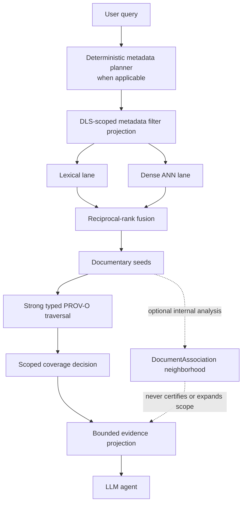

# Fork architecture

The Pommerieux OpenRAG fork is a system for verifiable documentary
investigation. It retains upstream OpenRAG's application stack and adds an
explicit separation between discovery, documentary closure, verified reading
and model reasoning.

## Architectural stages

1. **Planning.** A deliberately bounded, deterministic French/English grammar
   identifies supported metadata constraints. It performs no metadata-planner
   LLM call. Queries without metadata intent remain normal q1 queries.
2. **Structural restriction.** `openrag.metadata-filter v1` is resolved against
   the metadata side index with the caller's DLS-scoped OpenSearch client.
   Only `TRUE` occurrences are eligible; `FALSE` and `UNKNOWN` are distinct.
3. **Discovery.** Lexical and dense lanes search the same eligible occurrence
   set and are fused with RRF. ANN membership remains approximate.
4. **Seeds.** Ranked results identify source-document occurrences from which
   an investigation can begin. A ranked chunk is discovery evidence, not proof
   that its document was fully read.
5. **Strong closure.** Only explicit role/type combinations approved by the
   versioned `documentary-prov-o` policy can extend certifiable scope. Every
   graph query uses the caller's DLS context.
6. **Verified reading and coverage.** Each discovered document is read in
   stable source order and checked against its immutable ingestion profile.
   One fail-closed function issues `openrag.scope-coverage v1`.
7. **Evidence projection and reasoning.** The full verified artifact remains
   available to the application, while the model receives ranked leaf evidence,
   bounded linked-document leaves, a document manifest and the certificate.

## Discovery is not investigation

OpenSearch discovery is approximate or probabilistic where ANN is involved.
For fixed ordered lanes, RRF fusion and its stable chunk tie-break are
deterministic; that does not make the ANN candidate set exact.

PROV-O closure is deterministic over explicit, accessible documentary
relations for a fixed graph view and the declared policy. It does not infer
new strong relationships from metadata. A `DocumentAssociation` neighborhood
is a separate bounded view of documentary proximity and is non-certifying.

Coverage certifies what was actually traversed and read under the declared
policy. It does not prove that every relevant object in a physical archive was
indexed, visible or discovered as a seed.

## Trust boundaries

| Boundary | Authority | Not authoritative for |
| --- | --- | --- |
| Source and metadata observations | Source-qualified stored evidence | Unconditional factual truth |
| PROV-O relation | Validated explicit relation plus scope policy | Similarity, shared metadata or guessed lineage |
| Coverage service | Traversal and verified-read facts | Relevance of undiscovered or inaccessible archive objects |
| DLS-scoped OpenSearch client | Caller-visible candidates, counts and graph nodes | Granting access through a relation |
| LLM agent | Reasoning and response composition over projected evidence | Truth, coverage, DLS or strong provenance creation |
| Workspace configuration | Functional models, prompt and retrieval settings | Deployment images, resources, ingress or secrets |
| GitOps | Deployment topology and provider connectivity | Functional agent/planner selection, prompt or retrieval behavior |

## Current status

**Available now:** Retrieval v2, structured metadata API/Agent search,
deterministic metadata planning, strong PROV-O closure, scoped coverage,
archive-backed metadata profiles, the filter side index and DLS enforcement.

**Internal / disabled in product:** `DocumentAssociation` neighborhood
construction and candidate-lineage evidence.

**Planned:** end-to-end OpenArchiver attachment ingestion through the connector
contract, product activation of association neighborhoods after a separately
reviewed policy, and any trusted lineage inference.

## Source of truth

The implementation boundaries are visible in
[`SearchService`](https://github.com/FermedePommerieux/openrag-compose/blob/975f933fa3149dd60a0f481d5a51ae184d6ddf0d/src/services/search_service.py),
[`RetrievalService`](https://github.com/FermedePommerieux/openrag-compose/blob/975f933fa3149dd60a0f481d5a51ae184d6ddf0d/src/services/retrieval_service.py),
the [scope traversal policy](https://github.com/FermedePommerieux/openrag-compose/blob/975f933fa3149dd60a0f481d5a51ae184d6ddf0d/src/services/scope_traversal_policy.py),
and the [runtime behavior profile](https://github.com/FermedePommerieux/openrag-compose/blob/975f933fa3149dd60a0f481d5a51ae184d6ddf0d/src/services/runtime_behavior.py).

Continue with [Truth and provenance](/architecture/truth-and-provenance),
[PROV-O documentary closure](/architecture/prov-o),
[Retrieval and coverage](/architecture/retrieval-and-coverage), and
[Security and DLS](/security/dls).
