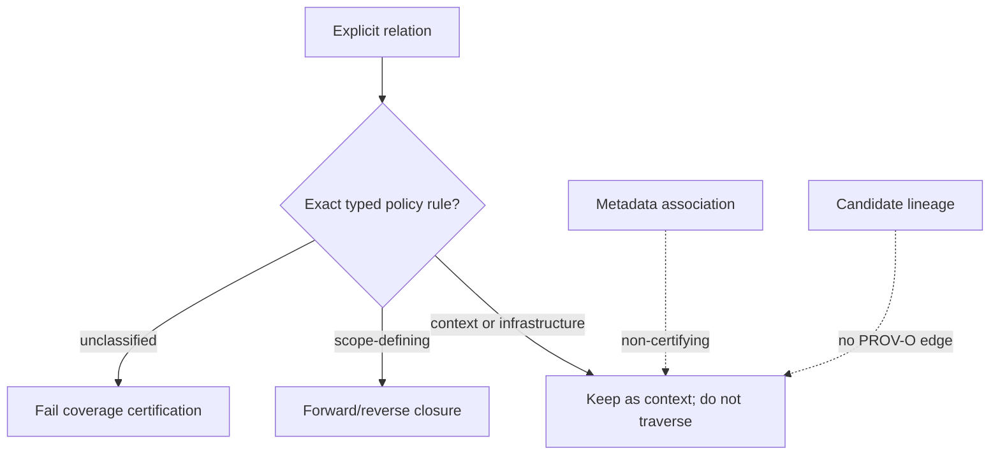

# PROV-O documentary closure

The fork stores source identity separately from source location and validates a
bounded W3C PROV-O profile at ingestion. Each relation has a fixed role, typed
target and full PROV-O predicate. Unknown roles, arbitrary predicates and
role/predicate mismatches are rejected.

The source-provenance envelope is version `1.0`; the certifiable traversal
policy is `documentary-prov-o` version `1`. These are related but distinct
contracts: the envelope describes explicit source relations, while the policy
decides whether an exact role/source-type/target-type combination may expand a
documentary scope.

## Three separate evidence classes

| Evidence | Meaning | May expand certifiable closure? |
| --- | --- | --- |
| Strong explicit provenance relation | Validated relation supplied at a trusted ingestion boundary and classified by the traversal policy | Only when the exact typed policy rule is scope-defining |
| Weak metadata association | Bounded similarity supported by source-qualified metadata observations | No |
| Candidate lineage | Reproducible evidence that two occurrences merit review | No; no lineage edge is emitted |

An explicit PROV-O predicate alone is not sufficient. The policy currently
classifies approved email thread, reply/reference and attachment combinations
as scope-defining. Directory membership is infrastructure, archive containment
is contextual, and an unknown typed combination is unclassified and prevents
coverage certification.



## Identity and attachment example

```text
attachment entity
    └── attachment_of → parent email entity
                            └── member_of → email thread

same observed month / creator / MIME
    └── association evidence only
        └── not prov:wasDerivedFrom
```

The attachment and parent email have separate stable identities. A parent-mail
URL remains a location for navigation, not the attachment's binary identity.

## DLS and certification

Forward and reverse traversal use the caller's DLS-scoped OpenSearch client.
A relation never transfers access, and public graph edges appear only after
both endpoints resolve inside the same caller-visible scope. Hidden objects do
not consume public traversal limits.

Closure is deterministic only for a fixed accessible graph view and policy.
`coverage.complete=true` additionally requires successful verified reads of
every document and chunk required by the coverage contract. It is never a
claim that the physical archive is complete.

## Source of truth

See the [source-provenance model](https://github.com/FermedePommerieux/openrag-compose/blob/975f933fa3149dd60a0f481d5a51ae184d6ddf0d/src/models/source_provenance.py),
the [scope traversal policy](https://github.com/FermedePommerieux/openrag-compose/blob/975f933fa3149dd60a0f481d5a51ae184d6ddf0d/src/services/scope_traversal_policy.py),
[Source provenance](/source-provenance), and
[Retrieval and coverage](/architecture/retrieval-and-coverage).
