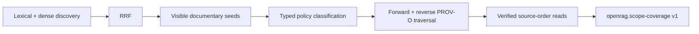

# Retrieval, PROV-O and coverage

The managed Chat agent exposes two evidence paths: verified reading of one
explicitly selected document and exhaustive investigation of a query-defined
documentary scope. Every general Chat search takes the second path. Ranked
retrieval remains an internal seed-discovery mechanism and a direct API
compatibility capability; it is not available to the managed agent as a
non-exhaustive answer path. The word “exhaustive” is always relative to the
selected document or the accessible policy closure; it never means the entire
physical archive.

## Current retrieval baseline

| Setting | Baseline value |
| --- | ---: |
| Query plan | q1 (the original user query) |
| Lexical candidates | 50 |
| Dense candidates | 50 |
| RRF constant | 60 |
| Scope seed budget | 100 |
| Multi-query discovery | false |

These values are current defaults, not permanent product promises. Multi-query
discovery exists as an opt-in mode but is not part of the q1 default.

The lexical and dense lanes are ranked independently and combined with
reciprocal-rank fusion. Equal fusion scores use persistent `chunk_id` as a
stable secondary key. This makes fusion reproducible for identical ordered
lane inputs.

Dense OpenSearch JVector search remains approximate-nearest-neighbour search.
Exact reranking of a bounded ANN pool does not recover candidates omitted from
that pool. The accepted contract is therefore `APPROXIMATE_MEMBERSHIP`, not
global deterministic membership. The diagnostic contract records hashes and
counts without exposing DLS-hidden identities.

## From discovery to investigation



Ranked seeds are discovery evidence. They become starting points only when
their canonical provenance is valid. The scope service traverses explicit
forward relations and policy-approved typed reverse relations with the same
user-scoped OpenSearch client.

The model cannot downgrade a managed Chat search to focused retrieval. The
thin tool always sends `scope_exhaustive` for a general query, including the
no-metadata fallback of the deterministic metadata tool. Only an explicit
human-selected document changes the mode, to a complete mono-document read.

Policy v1 currently treats exact email thread, reply/reference and attachment
relationships as scope-defining for approved type combinations. Archive
containment and ingestion directory membership can remain contextual or
infrastructure relations without opening a corpus-wide hub. An unclassified
visible relation is not traversed and prevents certification.

## Coverage contract

The machine contract is:

```text
openrag.scope-coverage v1
```

`coverage.complete=true` means that:

> The natural closure of the accessible documentary graph reached from the
> discovered seeds, under the explicit and versioned traversal policy, was
> exhausted, and every discovered document and chunk required by the contract
> completed its verified read.

Completion requires successful seed discovery, valid provenance on every seed,
a naturally empty graph frontier, no safety-limit or graph failure, no
unclassified visible relation, complete contiguous source-order reads, valid
cursors and immutable snapshot digests.

Completion does **not** mean that all physically relevant archive documents
were discovered. Objects can be absent from the index, hidden by DLS, missing
from the source, outside the strong graph, or omitted by approximate seed
discovery.

Reaching a configured limit while more visible work remains makes coverage
incomplete. Reaching the numeric limit exactly can still complete only when a
probe establishes that the accessible frontier is naturally empty.

## Bounded evidence projection

The complete verified leaf artifact remains available for provenance and UI
source cards. The LLM-facing projection carries ranked leaf seeds, at most one
source-order leaf from newly linked documents, a document manifest and the
coverage certificate. Generated summaries never replace source evidence.

The projection can be smaller than the verified scope. Its size is a context
and presentation bound, not a search-completeness bound. The coverage
certificate accounts for scope traversal and complete document reads before a
complete result may be claimed.

The LLM does not decide `coverage.complete`, create strong provenance, define
metadata truth or control DLS. Its job is reasoning over the bounded evidence
the deterministic services provide.

## Evidence

The normative implementation is
[`src/services/retrieval_service.py`](https://github.com/FermedePommerieux/openrag-compose/blob/975f933fa3149dd60a0f481d5a51ae184d6ddf0d/src/services/retrieval_service.py)
and
[`src/services/scope_traversal_policy.py`](https://github.com/FermedePommerieux/openrag-compose/blob/975f933fa3149dd60a0f481d5a51ae184d6ddf0d/src/services/scope_traversal_policy.py).
Design rationale and full invariants are preserved in
[ADR 0006](https://github.com/FermedePommerieux/openrag-compose/blob/975f933fa3149dd60a0f481d5a51ae184d6ddf0d/docs/adr/0006-verifiable-exhaustive-documentalist-retrieval.md)
and the [dense KNN contract](https://github.com/FermedePommerieux/openrag-compose/blob/975f933fa3149dd60a0f481d5a51ae184d6ddf0d/docs/adr/0008-dense-knn-determinism-contract.md).
