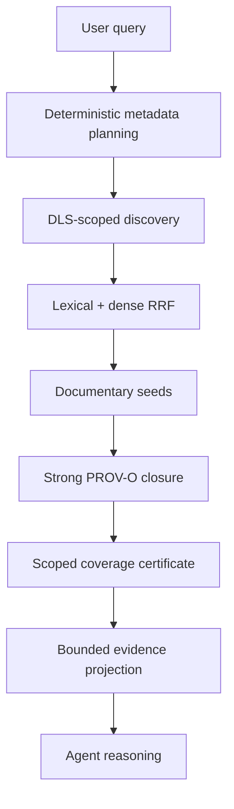

# OpenRAG — Pommerieux fork

This repository is the FermedePommerieux fork of
[upstream OpenRAG](https://github.com/langflow-ai/openrag). It is focused on
verifiable documentary investigation: discovering candidate documents,
traversing explicit accessible provenance relations, verifying the required
source reads and reporting exactly what the resulting coverage certificate
does—and does not—prove.

Compared with the upstream baseline used by this fork, it adds backend-owned
lexical+dense RRF discovery, structured metadata search, source-qualified
document metadata, strong policy-approved PROV-O closure, fail-closed scoped
coverage and bounded evidence projection for the LLM. See
[Differences from upstream](/upstream/differences) for pinned comparison
revisions and evidence.

The core truth contract is:

- metadata is an observation, not automatically factual truth;
- documentary association is not provenance derivation;
- dense candidate membership may be approximate;
- scoped coverage is complete only for the accessible documentary graph
  reached from discovered seeds under the declared policy;
- the LLM reasons over evidence but does not decide truth, coverage, DLS or
  strong provenance.

Read [Truth and provenance](/architecture/truth-and-provenance) before using a
coverage result as an absence claim.

:::tip
Ready to run the platform? Follow the [quickstart](/quickstart). For the fork's
contract boundaries, start with [Fork architecture](/architecture/overview).
:::

## Platform foundation

The fork retains the upstream OpenRAG application foundation:

- [Langflow](https://docs.langflow.org) provides the managed Agent execution
  graph and visual flow environment. The fork keeps retrieval, coverage and DLS
  policy in the backend rather than reimplementing them in the flow.
- [OpenSearch](https://docs.opensearch.org/latest/) stores indexed source
  chunks, vectors and the isolated metadata-filter projection. Its DLS-scoped
  client bounds every search and graph query.
- [Docling](https://docling-project.github.io/docling/) parses and chunks
  documents for ingestion.
- The FastAPI backend owns deterministic planning, retrieval, provenance,
  coverage, runtime configuration and public-payload redaction.
- The Next.js frontend presents chat, source evidence, settings and operational
  status.

## Investigation pipeline

The system never promises to find every physically relevant archive object.
It makes its narrower, verifiable claim observable and fails closed when that
claim cannot be certified.
