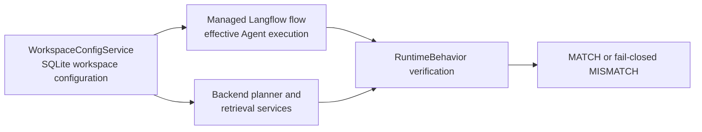

# Runtime and GitOps ownership

The production baseline separates functional application behavior from
deployment topology. Changing a deployment manifest must not silently select a
different Agent model, planner model, prompt or retrieval policy.

## Functional runtime authority

With the default `OPENRAG_STORAGE_MODE=db`, `WorkspaceConfigService` and the
SQLite workspace configuration are the sole persistence authority for
functional runtime settings. This includes Agent and planner provider/model
selection, the managed system prompt, embedding selection and retrieval/scope
settings.

The managed Langflow flow is the effective Agent execution graph. Backend
services are the effective planner, retrieval, provenance and coverage
execution boundaries.

Legacy `config.yaml` is a migration/compatibility representation, not the
authority for the supported production baseline. Explicit `hybrid` and `files`
modes remain rollback/legacy compatibility modes; choosing them intentionally
changes that storage behavior and lies outside the default DB-authoritative
invariant.

## RuntimeBehavior

`GET /api/settings/runtime-behavior` returns a non-secret
`RuntimeBehaviorProfile v1`. It compares configured and effective Agent model,
planner model and prompt hashes; reports embedding, retrieval, multi-query and
scope settings; records managed-flow guard information; and produces a
deterministic runtime behavior fingerprint.

`MATCH` means the configured functional selections agree with the observed
effective runtime at the checks represented in the profile. `MISMATCH` is not
silently accepted: managed-flow startup and settings changes fail closed. The
fingerprint is an operational observation and is not a permanent product or
fork identity.

The implementation is
[`src/services/runtime_behavior.py`](https://github.com/FermedePommerieux/openrag-compose/blob/975f933fa3149dd60a0f481d5a51ae184d6ddf0d/src/services/runtime_behavior.py).

## GitOps boundary

GitOps owns deployment concerns:

- images and immutable deployment revisions;
- replicas, resources and scheduling;
- networking, services and ingress;
- secret references;
- provider endpoint and credential connectivity.

GitOps does **not** own functional behavior:

- Agent model;
- planner model;
- managed system prompt;
- retrieval strategy, candidate budgets or scope policy behavior.

Those settings remain application-runtime concerns even when GitOps supplies
the connectivity required to reach a provider. No image rebuild or GitOps
change is required to apply a supported functional model or prompt selection.

## LLM role

The LLM reasons over bounded evidence and composes responses. It is not a
source of documentary truth. It does not decide `coverage.complete`, define
metadata truth, create strong provenance relations, control DLS or replace the
backend retrieval policy.
